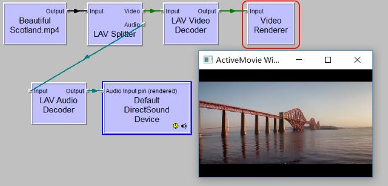
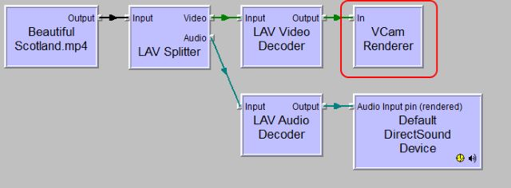
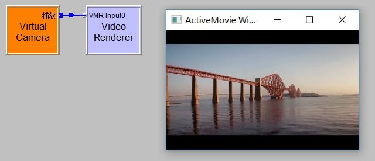

# vcam4j

#### 介绍
Java虚拟摄像头 
VCamSDK：https://www.e2esoft.com/sdk/vcam-sdk/

#### 软件架构
Java、Type-safe Java/COM bridge

#### 主要特点

> 支持所有 Windows 操作系统和所有应用程序，包括 Windows 应用商店应用程序;  
> 高度可定制 – 设置设备名称、更改默认图像、默认输出视频大小和帧速率;  
> 易于使用 – 使用其 DirectShow 视频渲染器滤镜轻松播放任何虚拟摄像机;  
> 使用其 COM 接口（IVCamRenderer）将RGB24/RGB32/YUY2/NV12格式的视频数据或捕获屏幕区域发送到虚拟摄像机;  
> 高性能和低CPU 使用率;  
> 填充模式、镜像和翻转的设置;  
> 使用监控 – 当其他应用程序打开或关闭虚拟摄像机时收到通知;  
> 支持多个实例;  
> 重量轻的封装，可轻松集成到您的应用中;  

#### 它是如何工作的？

VCam SDK 基于 DirectShow 技术，下面是如何向 VCam 播放视频文件。  
使用默认的视频渲染器在图形中播放视频文件：  
  
使用 VCam 渲染器滤镜播放视频文件 - 就像使用默认的一样：  
  
现在视频已发送到虚拟摄像机：  
  
我们可以看到，这是很容易播放视频文件到VCam，你也可以播放视频捕获设备，视频流，图像文件或任何其他视频源到VCam与直接显示轻松。  
除了使用 DirectShow，您还可以使用IVCamRenderer COM 接口将视频帧直接发送到 VCam 驱动程序并执行更多操作。有关详细信息，请查看 SDK 中的演示应用程序。  

#### 安装教程

1.下载com4j
> http://com4j.kohsuke.org/

2.生成Java Mode  
> java -jar tlbimp.jar -o vcam -p com.e2esoft.vcam.renderer VCamRenderer.tlb 

3.生成DShow版本
> java -jar tlbimp.jar -o vcam -p com.e2esoft.vcam VCamCOM.tlb  
> java -jar tlbimp.jar -o vcam -p com.e2esoft.vcam.source VCamSource.tlb  
 

